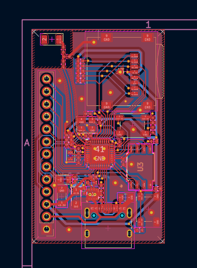
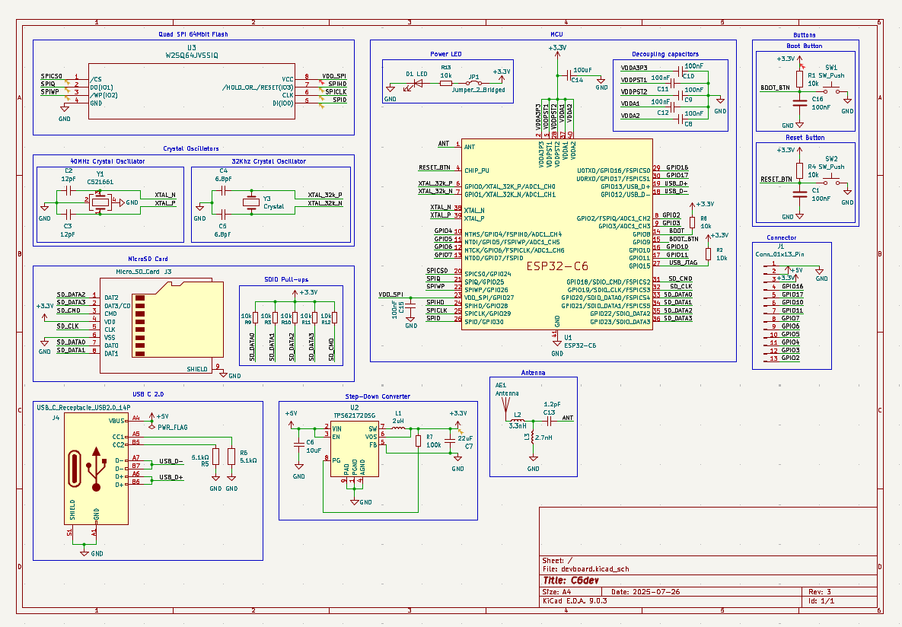
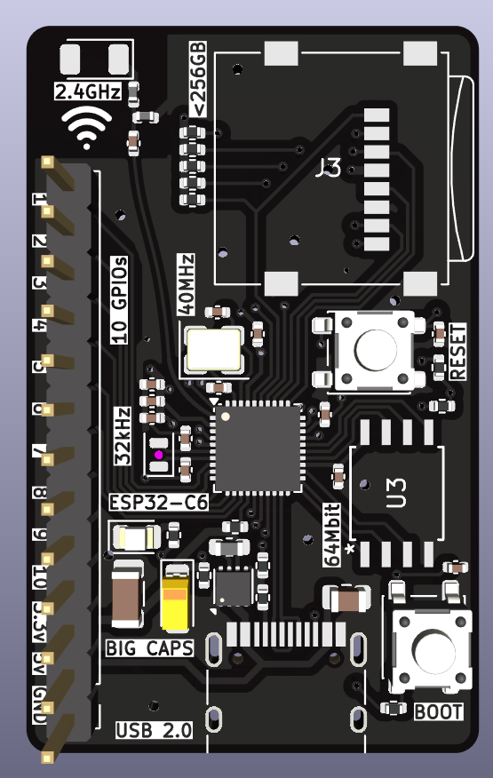
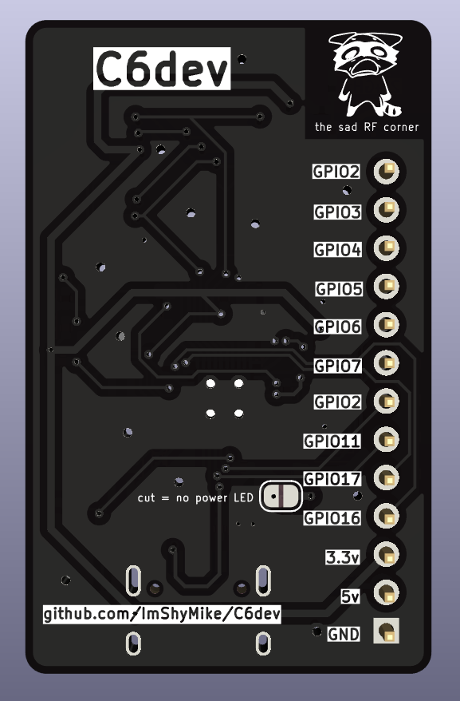

## Total time: - hours

---

# July 26th: Started researching

Started looking for and reasearching a bunch of chips from Expressif and STMicroelectronics

Most interesting ones:

- ESP32-S3
- ESP32-C3
- ESP32-C6
- STM32F407
- STM32F746

**Total time spent: 1h**

---

# July 26th pt2: Made a choice and started designing the schematic

I ended up choosing the ESP32-C6 for it's low power consumption, speed, relatively low complexity and availability

- [ESP-32-C6](https://jlcpcb.com/partdetail/EspressifSystems-ESP32C6/C5364646)

**Total time spent: 1h**

---

# July 26th pt3: More schematic making :sob:

Tried to actually use net labels propperly and follow best practices while keeping the schematic clean and already have a 5v to 3.3v step down, crystals, flash, usb c, boot/reset buttons and a microSD.

Schematicsssss

- https://jlcpcb.com/api/file/downloadByFileSystemAccessId/8588949628351471616
- https://jlcpcb.com/api/file/downloadByFileSystemAccessId/8588881904569356288
- https://www.espressif.com/sites/default/files/documentation/esp32-c6_datasheet_en.pdf

**Total time spent: 3h**

---

# July 26th pt4: Finishing up the schematic

Should be finished with the schematic will double check everything for errors and start the with the PCB

**Total time spent: 2h**

---

# July 27th: PCB done (i think)

> KiCad autosave is the best thing ever made by humanity

I thought that i had lost almost 2 hours of work but thankfully autosave saved me (don't ask why i didn't save for 2 hours, i don't know either)

After a lot of pain and suffering, and forgetting to place the pullups on the SDIO lines, the PCB is mostly finished and only needs some finishing touches

im about 1% confident that the antenna will work

Also fixed some minor issues with the schematic

[i love RF i love RF i love RF](https://jlcpcb.com/api/file/downloadByFileSystemAccessId/8588940948130156544)

**Total time spent: 6h**

---

# July 27th pt2: Polishing

Polishing tiny details on the PCb and adding silkscreen as well as checking prices

**Total time spent: 1h**

---

# July 27th pt2: SILKSCREEEEEEN

PCB was looking extremely boring so ofc i had to spend copious amounts of time adding silkscreen art :3

(it's still not done, i need MORE)

**Total time spent: 2h**