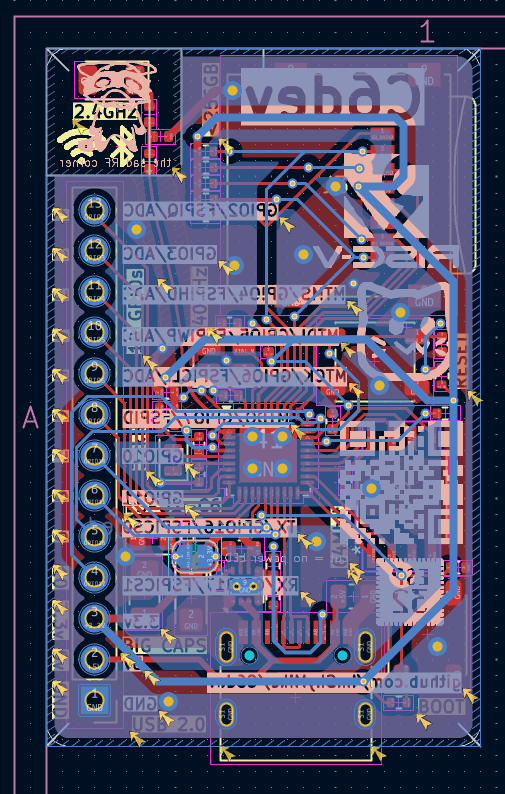

# C6dev

A tiny and low power dev board for the ESP32-C6 with 10 GPIO pins, microSD card slot, 64Mbit (8MB) of Quad SPI Flash, USB C 2.0, a step-down converter for efficiency, 2.4 GHz ceramic chip antenna and very cool silkscreen. All pins are labeled with their number, actual GPIO and even other functions.

---

I've been wanting to make a devboard for a while now so i decided to make one with a RISC-V, low power MCU while breaking out a bunch of useful stuff while still keeping an acceptable amount of GPIO.

It was quite a lot harder than I expected with all the datasheet searching and looking up everything to make sure it works but atleast the routing was quite fun.

---

| PCB front | PCB back |
|:---------:|:--------:|
|  |  |

---

## PCB

---

## BOM

| Item | Quantity | Price (USD) |
|:----:|:--------:|:-----------:|
| PCB  |       1  |         $77 |

---

## 3D Model

[STL (renders on GitHub)](PCB/devboard/devboard.stl)

[STEP](PCB/devboard/devboard.stl)

[WRL (best)](PCB/devboard/devboard.wrl)
